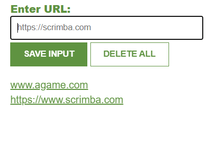

# Leads Tracker App

This app is developed for saving leads, websites etc. via Firebase database. 
 
 
Entering manually a lead/website etc and click on "SAVE INPUT" button. The data will be saved in firebase 
When deleting all lead/websites double click on "DELETE ALL". This will also clear the database.  
Be aware that the databaseURL: "https://leads-tracker-app-239f0-default-rtdb.europe-west1.firebasedatabase.app/" is unique for every user so you have to create your own in order to use it.  

## 🛠️Tech Stack
    

## ⚙️How it works?

1.Clone the repository to your PC
Use git clone [repo-link] or download the ZIP and extract the files.

2. Go to Firebase and create your own database.

## 🖻SS

## 🔛Live link

Vezi aplicatia live aici: 
[GhPages](https://isabelamihai.github.io/chrome-extension)  
[Netlify](https://chrome-extension-a.netlify.app/)
